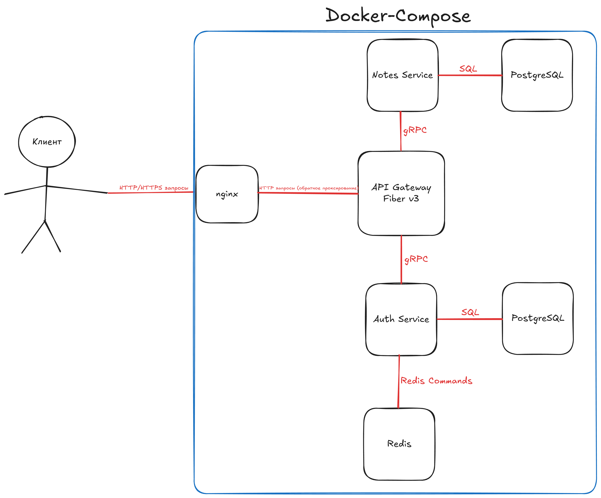

# Go-Get-Note

## Содержание
- Обзор
- Архитектура
- Технологии
- Структура проекта
- Настройка и установка
- API эндпоинты
- Архитектурные решения
- Разработка

## Обзор

Go-Get-Note - это Backend для создания заметок на основе микросервисной архитектуры, которое позволяет пользователям создавать, получать, обновлять и удалять заметки. Система построена с отдельными сервисами для аутентификации и управления заметками, соединенными через API-шлюз, который маршрутизирует запросы и обеспечивает политики безопасности.

## Архитектура

Приложение следует микросервисной архитектуре, состоящей из трех основных сервисов:

1. **Сервис аутентификации**: Обрабатывает регистрацию пользователей, аутентификацию и управление токенами.
2. **Сервис заметок**: Управляет операциями с заметками (CRUD), проверяя JWT-токен.
3. **API-шлюз**: Маршрутизирует запросы клиентов к соответствующим микросервисам и обрабатывает промежуточное ПО для аутентификации.

Каждый сервис работает независимо со:
- Собственной базой данных
- Выделенной бизнес-логикой

Коммуникация между сервисами использует gRPC, в то время как шлюз предоставляет REST HTTP API для клиентов.


## Технологии

- **Язык программирования**: Go 1.24.2
- **Базы данных**: 
  - PostgreSQL 16.8 (отдельные экземпляры для сервисов Auth и Notes)
  - Redis 7.4.2 (кэширование профиля пользователя)
- **API**: 
  - gRPC для внутренней коммуникации
  - gRPC Gateway для трансляции REST API
  - Protocol Buffers (proto3) для определения сервисов
- **Веб-сервер**: 
  - Fiber v3 (HTTP фреймворк)
  - Nginx 1.27.5 (обратный прокси)
- **Аутентификация**: JWT токены
- **Контейнеризация**: Docker и Docker Compose
- **Логирование**: Zap Uber Logger
- **Миграции базы данных**: golang-migrate/migrate v4

## Структура проекта

```
.
├── api/                # Определения Protocol Buffer
│   ├── auth/           # Определения API для сервиса аутентификации
│   ├── notes/          # Определения API для сервиса заметок
│   └── common/         # Общие определения API
├── build/              # Конфигурации сборки Docker
├── cmd/                # Точки входа в приложение
│   ├── auth/           # Основной код сервиса аутентификации
│   ├── gateway/        # Основной код API-шлюза
│   └── notes/          # Основной код сервиса заметок
├── deploy/             # Конфигурации развертывания
│   └── nginx/          # Конфигурация Nginx
├── internal/           # Код приложения (приватный)
│   ├── auth/           # Реализация сервиса аутентификации
│   ├── gateway/        # Реализация API-шлюза
│   └── notes/          # Реализация сервиса заметок
├── migrations/         # Миграции базы данных
│   ├── auth/           # Миграции сервиса аутентификации
│   └── notes/          # Миграции сервиса заметок
├── pkg/                # Общие пакеты (публичные)
│   ├── api/            # Сгенерированный код Protocol Buffer
│   ├── db/             # Утилиты для работы с базой данных
│   ├── logger/         # Утилиты для логирования
│   └── shutdown/       # Утилиты для корректного завершения работы
└── scripts/            # Служебные скрипты
```

Каждый сервис старается следовать принципам Чистой архитектуры:
1. **Адаптеры**: Реализации интерфейсов (HTTP, gRPC, база данных)
2. **Приложение**: Бизнес-логика/варианты использования
3. **Конфигурация**: Настройка сервиса
4. **Домен**: Основные бизнес-сущности и правила
5. **Порты**: Определения интерфейсов

## Настройка и установка

### Предварительные требования
- Go 1.24.2+
- Docker и Docker Compose
- Protocol Buffer компилятор (для разработки)

### Запуск с помощью Docker Compose

1. Клонировать репозиторий
2. Скопировать пример файла переменных окружения
```bash
cp .env.example deploy/.env
```

3. При необходимости обновить переменные окружения в .env

4. Запустить все сервисы:
```bash
cd deploy
docker-compose up -d
```

5. Приложение будет доступно по адресу http://localhost:80

### Запуск для разработки

1. Установить необходимые инструменты Go:
```bash
task proto:tools
```

2. Сгенерировать код Protocol Buffer:
```bash
# Для Linux/Unix
task proto:gen:linux
# Для Windows
task proto:gen:windows
```

3. Для запуска отдельных сервисов перейдите в соответствующие директории:
```bash
cd cmd/auth
go run main.go
```

## API эндпоинты

### Сервис аутентификации

#### Регистрация
- **POST** `/api/v1/auth/register`
- **Тело**: 
  ```json
  {
    "email": "user@example.com",
    "username": "username",
    "password": "password"
  }
  ```
- **Ответ**:
  ```json
  {
    "user_id": "uuid",
    "access_token": "jwt-token",
    "refresh_token": "refresh-token",
    "expires_at": "timestamp"
  }
  ```

#### Вход
- **POST** `/api/v1/auth/login`
- **Тело**:
  ```json
  {
    "email": "user@example.com",
    "password": "password"
  }
  ```
- **Ответ**:
  ```json
  {
    "user_id": "uuid",
    "access_token": "jwt-token",
    "refresh_token": "refresh-token",
    "expires_at": "timestamp"
  }
  ```

#### Обновление токена
- **POST** `/api/v1/auth/refresh`
- **Тело**:
  ```json
  {
    "refresh_token": "refresh-token"
  }
  ```
- **Ответ**:
  ```json
  {
    "access_token": "jwt-token",
    "refresh_token": "refresh-token",
    "expires_at": "timestamp"
  }
  ```

#### Выход
- **POST** `/api/v1/auth/logout`
- **Тело**:
  ```json
  {
    "refresh_token": "refresh-token"
  }
  ```
- **Ответ**: `204 No Content`

#### Получение профиля пользователя
- **GET** `/api/v1/user/profile`
- **Заголовки**: `Authorization: Bearer access-token`
- **Ответ**:
  ```json
  {
    "user_id": "uuid",
    "email": "user@example.com",
    "username": "username",
    "created_at": "timestamp"
  }
  ```

### Сервис заметок

#### Создание заметки
- **POST** `/api/v1/notes`
- **Заголовки**: `Authorization: Bearer access-token`
- **Тело**:
  ```json
  {
    "title": "Note title",
    "content": "Note content"
  }
  ```
- **Ответ**:
  ```json
  {
    "note": {
      "note_id": "uuid",
      "user_id": "uuid",
      "title": "Note title",
      "content": "Note content",
      "created_at": "timestamp",
      "updated_at": "timestamp"
    }
  }
  ```

#### Получение заметки
- **GET** `/api/v1/notes/{note_id}`
- **Заголовки**: `Authorization: Bearer access-token`
- **Ответ**:
  ```json
  {
    "note": {
      "note_id": "uuid",
      "user_id": "uuid",
      "title": "Note title",
      "content": "Note content",
      "created_at": "timestamp",
      "updated_at": "timestamp"
    }
  }
  ```

#### Список заметок
- **GET** `/api/v1/notes?limit=10&offset=0`
- **Заголовки**: `Authorization: Bearer access-token`
- **Ответ**:
  ```json
  {
    "notes": [
      {
        "note_id": "uuid",
        "user_id": "uuid",
        "title": "Note title",
        "content": "Note content",
        "created_at": "timestamp",
        "updated_at": "timestamp"
      }
    ],
    "total_count": 42,
    "offset": 0,
    "limit": 10
  }
  ```

#### Обновление заметки
- **PATCH** `/api/v1/notes/{note_id}`
- **Заголовки**: `Authorization: Bearer access-token`
- **Тело**:
  ```json
  {
    "title": "Updated title",
    "content": "Updated content"
  }
  ```
- **Ответ**:
  ```json
  {
    "note": {
      "note_id": "uuid",
      "user_id": "uuid",
      "title": "Updated title",
      "content": "Updated content",
      "created_at": "timestamp",
      "updated_at": "timestamp"
    }
  }
  ```

#### Удаление заметки
- **DELETE** `/api/v1/notes/{note_id}`
- **Заголовки**: `Authorization: Bearer access-token`
- **Ответ**: `204 No Content`

## Архитектурные решения

### Микросервисная архитектура
Приложение спроектировано как отдельные микросервисы для обеспечения:
- **Масштабируемость**: Каждый сервис может масштабироваться независимо от других в зависимости от нагрузки.
- **Устойчивость**: Сбои в одном сервисе не влияют на другие.
- **Гибкость технологий**: Разные сервисы могут использовать разные технологии при необходимости.

### Чистая архитектура
Каждый сервис следует принципам чистой архитектуры для обеспечения:
- **Разделение ответственности**: Четкое разграничение между бизнес-логикой и деталями реализации
- **Тестируемость**: Возможность легко тестировать бизнес-логику в изоляции
- **Сопровождаемость**: Изменения внешних зависимостей не влияют на бизнес-правила

### Стратегия аутентификации
Приложение использует JWT токены с шаблоном обновления токена для:
- **Аутентификация без состояния**: Нет необходимости хранить данные сессии в разных сервисах.
- **Безопасность**: Короткоживущие токены доступа и долгоживущие токены обновления.
- **Пользовательский опыт**: Бесшовное обновление токенов без частой повторной аутентификации.

### Хранение данных
- **PostgreSQL**: Используется для постоянного хранения данных пользователей и заметок.
- **Отдельные базы данных**: Каждый сервис имеет свою базу данных для независимого масштабирования.
- **Redis**: Используется для кэширования.

### Дизайн API
- **gRPC внутренне**: Для эффективного бинарного обмена между сервисами.
- **REST внешне**: Для удобного клиентского доступа к API.
- **Protocol Buffers**: Единый источник истины для определений API, генерирующий как gRPC, так и REST эндпоинты.

### Соображения безопасности
- **Валидация токенов**: JWT токены проверяются на всех защищенных эндпоинтах.
- **Безопасность соединений**: Внутреннее взаимодействие сервисов защищено.
- **Хеширование паролей**: Пароли надежно хешируются с использованием bcrypt.
- **Черный список токенов**: Недействительные токены отслеживаются для предотвращения повторного использования.

## Разработка

### Генерация кода

Файлы Protocol Buffer используются для генерации:
- Реализаций сервисов Go
- Кода клиента/сервера gRPC
- REST API шлюза

Для генерации кода после обновления файлов `.proto`:

```bash
# Для Linux/Unix
task proto:gen:linux
# Для Windows
task proto:gen:windows
```

### Тестирование

Запуск тестов:

```bash
go test ./...
```

### Линтинг

Запуск линтеров:

```bash
golangci-lint run
```

### Схемы
